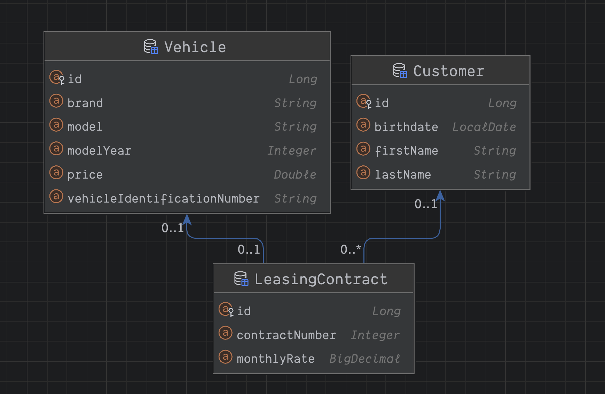
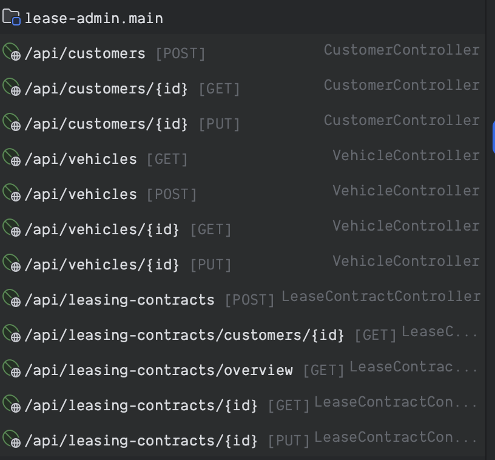

Service for leasing a vehicle to a customer
----------------------------------------------
#### Entity Relationship Design

This project is a web application that allows you to manage vehicle leasing, customers, and lease contracts. It uses MySQL as the database, Java 17 as the backend service, and React as the frontend UI.

### How to Run

You can run the project either locally or using Docker.

-   To run locally, you need Java 17 and Gradle installed. Then, follow these steps:

    1.  Go to lease-it/lease-api/ and run: `./gradlew bootRun`
    2.  Go to lease-it/lease-ui/ and run: `npm start`
    3.  The backend service will be available at `localhost:8080/api`
    4.  The frontend UI will be available at `localhost:3000`
-   To run using Docker, you need Docker Desktop installed. Then, follow these steps:

    1.  Go to the root directory and run: `docker compose up -d`
    2.  The backend service will be available at `localhost:9090/api`
    3.  The frontend UI will be available at `localhost:3031`

### API Documentation

You can access the API documentation at `localhost:8080/api/docs` or `localhost:9090/api/docs`, depending on how you run the project.

### Features

-   The backend service supports all the required operations and provides paging for GET requests to improve performance.
-   The frontend UI uses Material-UI designs and allows you to view, create, update, and delete vehicles, customers, and contracts.

